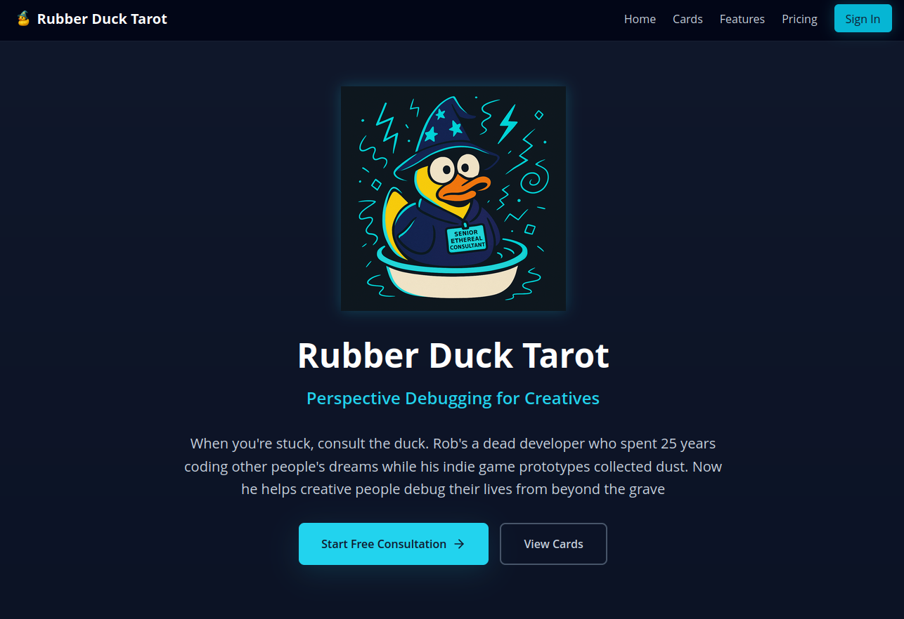

# Rubber Duck Tarot: Your Personal Perspective Debugger

**[➡️ Live Demo: rubberducktarot.app](https://rubberducktarot.app)**

---

### A Note on This Repository

This is a solo project created for portfolio and "show-and-tell" purposes. It is not actively seeking open-source contributions. If you are interested in collaborating, please reach out privately.

---

Rubber Duck Tarot is a unique decision-making tool disguised as divination cards, featuring Rob Chen, a deceased full-stack developer whose soul is now trapped in a rubber duck wearing a wizard hat. Rob's mission from beyond the grave is to help creative people debug their lives and break through mental blocks when they're stuck.

### Core Concept: Debugging for Creative Minds

The project transforms the traditional Lenormand card system into a practical "blocker stopper" tool, inspired by Brian Eno’s Oblique Strategies. Users consult Rob (the duck) when facing creative blocks, tough decisions, or mental loops, receiving randomized perspective prompts that trigger lateral thinking to break thought patterns.

### Why Consult the Duck?

- **Fun-First Strategy:** The primary positioning is "fun over function". The entertainment value drives engagement, while the utility keeps users coming back. Rob's "delightfully absurd authority" – a dead developer trapped in a bath toy giving life advice – is inherently ridiculous yet oddly credible.
- **Perspective Debugging:** This is not fortune-telling; it's decision-making support using proven pattern interrupt techniques. It's a debugging methodology disguised as divination cards, offering a fun alternative to traditional productivity frameworks.
- **Unique Differentiation:** Rubber Duck Tarot sits at the convergence of creative productivity tools, mental health and self-help apps, and humor-driven character brands. It differentiates by offering zero mystical claims, targeting rational individuals, embracing blocks as normal data, and providing quick hits of insight without demanding complex systems or rigid routines. It's designed to be a skeptic-friendly self-care tool.

### Rob's Personality & Charm

Rob brings a unique, self-aware, helpful, slightly absurd, and genuinely useful tone to every interaction. Users can expect a "Magic 8-ball energy" with satisfying anticipation rituals, exaggerated card shuffling, and dramatic pauses before revelations. Rob exhibits unexpectedly human personality quirks, like getting distracted by his reflection, making sarcastic comments, and referencing his "union-mandated afterlife coffee breaks". His backstory involves a "dual failure" in both coding other people's dreams and his own music, leading to his "karmic load balancing" where he helps others avoid similar mistakes.

### Key Features

- **Adaptive Perspective Cards:** The core feature providing context-aware insights based on selected cards and the user's specific problem. The card system acts as a "cognitive constraint," forcing productive cognitive friction and leading to genuine breakthroughs by preventing the AI from simply validating user biases.
- **Intelligence Engine:** Analyzes user patterns over time, offering insights, predicting potential blocks, and providing personalized coaching from Rob.
- **Block Tracker:** Transforms the process of getting stuck from a source of shame into a trackable skill, quantifying self-improvement through pattern recognition and celebrating progress. It offers psychological relief by externalizing problems.
- **Chat with Rob:** An on-demand chat feature where Rob acts as a "pair-programming for your life," providing instant, context-aware advice. He treats feelings like stack-traces and assumptions like legacy code, offering a shameless sounding board for users to externalize their thinking.
- **Notion Export:** A premium feature allowing users to export Rob's action steps directly to Notion, bridging the gap between insight and execution and transforming advice into actionable life infrastructure.
- **Blocker Surfacer:** A psychological discovery mechanism that helps users identify unconscious blocks through card-based pattern recognition and guided dialogue. It uses projective testing and cognitive load optimization to transform vague dissatisfaction into actionable block identification.

### Tech Stack

- **Frontend**: React 19, TypeScript, Vite
- **Backend**: Node.js, Express, TypeScript Microservices
- **Styling**: Tailwind CSS 4
- **AI**: Anthropic Claude API
- **Database**: Drizzle ORM with Supabase (PostgreSQL) for production and SQLite for local development.
- **Authentication**: Supabase Auth
- **Build Tools**: Vite + SWC for a fast and modern development experience.
- **Deployment**: Netlify, Railway

For a deep-dive into technical details see [docs/ARCHITECTURE.md](docs/ARCHITECTURE.md).

For contributions, please reach out privately. Read [docs/CONTRIBUTING.md](docs/CONTRIBUTING.md) for more information.
